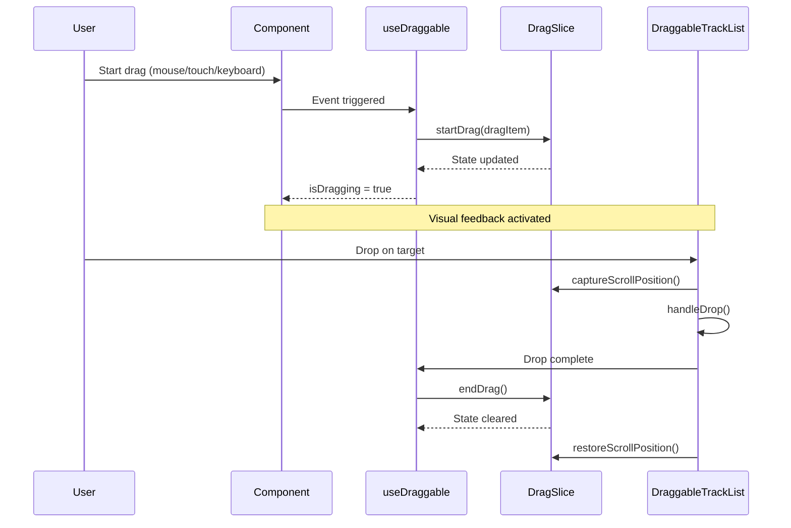
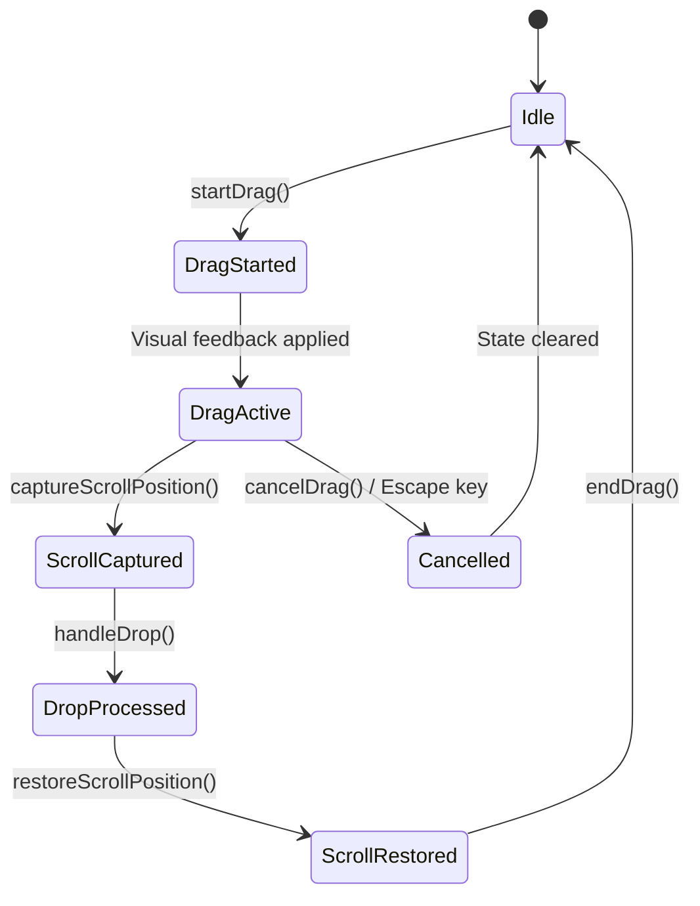

# Design Document

## Overview

This design document outlines the architectural transformation of the drag-and-drop system in the Spotify Playlist Mixer from its current fragmented state to a robust, type-safe, centralized system using Zustand for state management. The new architecture will eliminate the current issues with non-functional internal reordering, failed external transfers, ineffective scroll locking, and scroll position loss.

The refactor will replace the existing React Context-based approach with a Zustand slice integrated into the existing store, providing better performance, type safety, and maintainability while preserving all existing functionality.

## Architecture

### High-Level Architecture Principles

1. **Centralized State Management**: Replace DragContext with a Zustand slice for better performance and type safety
2. **Type-Safe Operations**: Implement strict TypeScript interfaces for all drag operations and payloads
3. **Unified Hook Interface**: Simplify useDraggable hook to focus solely on event handling and reporting
4. **Scroll Position Preservation**: Implement capture-and-restore pattern for maintaining scroll context
5. **Modal Coordination**: Automatic visual feedback and interaction management during drag operations
6. **Cross-Platform Compatibility**: Seamless support for mouse, touch, and keyboard interactions

### Current State Analysis

#### Existing Implementation Issues
- **DragContext.js**: Currently manages global state but lacks type safety and proper integration
- **useDraggable.ts**: Complex hook managing both state and events, leading to coupling issues
- **DraggableTrackList.tsx**: Contains legacy drag logic alongside new hook usage
- **Modal Components**: No coordination during external drag operations

#### Proposed Architecture Changes
- **Remove DragContext.js**: Replace with Zustand slice for better performance
- **Simplify useDraggable.ts**: Focus on event handling only, delegate state to store
- **Enhance DraggableTrackList.tsx**: Complete integration with new architecture
- **Add Modal Coordination**: Automatic visual feedback during drag operations

## Components and Interfaces

### Core Type Definitions

```typescript
// src/types/dragAndDrop.ts
export type DragSourceType = 'internal-track' | 'modal-track' | 'search-track';

export type DraggedItemPayload = {
  'internal-track': { track: MixedTrack; index: number };
  'modal-track': { track: SpotifyTrack; source: string };
  'search-track': { track: SpotifyTrack; query: string };
};

export interface DraggedItem<T extends DragSourceType = DragSourceType> {
  id: string; // Unique ID of the track being dragged
  type: T;
  payload: DraggedItemPayload[T];
  timestamp: number; // For debugging and cleanup
}

export interface DragState {
  isDragging: boolean;
  draggedItem: DraggedItem | null;
  dragStartTime: number | null;
  startDrag: <T extends DragSourceType>(item: DraggedItem<T>) => void;
  endDrag: () => void;
  cancelDrag: () => void;
}

export interface ScrollPositionState {
  scrollTop: number | null;
  captureScrollPosition: (container: HTMLElement) => void;
  restoreScrollPosition: (container: HTMLElement) => void;
  clearScrollPosition: () => void;
}
```

### Zustand Store Integration

#### Drag Slice Implementation

```typescript
// src/store/slices/dragSlice.ts
import { StateCreator } from 'zustand';
import { DragState, DraggedItem, DragSourceType, ScrollPositionState } from '../../types/dragAndDrop';
import { AppStore } from '..';

export interface DragSlice extends DragState, ScrollPositionState {}

export const createDragSlice: StateCreator<AppStore, [], [], DragSlice> = (set, get) => ({
  // Drag state
  isDragging: false,
  draggedItem: null,
  dragStartTime: null,

  // Scroll position state
  scrollTop: null,

  // Drag actions
  startDrag: <T extends DragSourceType>(item: DraggedItem<T>) => {
    const currentState = get();
    
    // Prevent concurrent drags
    if (currentState.isDragging) {
      console.warn('[DragSlice] Attempted to start drag while already dragging');
      return;
    }

    console.log(`[DragSlice] Starting drag: type=${item.type}, id=${item.id}`);
    
    set(
      {
        isDragging: true,
        draggedItem: item,
        dragStartTime: Date.now(),
      },
      false,
      'drag/startDrag'
    );
  },

  endDrag: () => {
    const currentState = get();
    
    if (!currentState.isDragging) {
      console.warn('[DragSlice] Attempted to end drag when not dragging');
      return;
    }

    console.log('[DragSlice] Ending drag successfully');
    
    set(
      {
        isDragging: false,
        draggedItem: null,
        dragStartTime: null,
      },
      false,
      'drag/endDrag'
    );
  },

  cancelDrag: () => {
    const currentState = get();
    
    if (!currentState.isDragging) {
      console.warn('[DragSlice] Attempted to cancel drag when not dragging');
      return;
    }

    console.log('[DragSlice] Canceling drag');
    
    set(
      {
        isDragging: false,
        draggedItem: null,
        dragStartTime: null,
      },
      false,
      'drag/cancelDrag'
    );
  },

  // Scroll position management
  captureScrollPosition: (container: HTMLElement) => {
    const scrollTop = container.scrollTop;
    console.log(`[DragSlice] Capturing scroll position: ${scrollTop}`);
    
    set(
      { scrollTop },
      false,
      'drag/captureScrollPosition'
    );
  },

  restoreScrollPosition: (container: HTMLElement) => {
    const currentState = get();
    
    if (currentState.scrollTop !== null) {
      console.log(`[DragSlice] Restoring scroll position: ${currentState.scrollTop}`);
      container.scrollTop = currentState.scrollTop;
      
      // Clear after restoration
      set(
        { scrollTop: null },
        false,
        'drag/clearScrollPosition'
      );
    }
  },

  clearScrollPosition: () => {
    set(
      { scrollTop: null },
      false,
      'drag/clearScrollPosition'
    );
  },
});
```

#### Store Integration

```typescript
// src/store/index.ts (additions)
import { createDragSlice, DragSlice } from './slices/dragSlice';

// Add DragSlice to the combined store type
export type AppStore = AuthSlice & PlaylistSlice & MixingSlice & UISlice & DragSlice;

// Add the slice to the store creation
export const useAppStore = create<AppStore>()(
  devtools(
    subscribeWithSelector((...args) => ({
      ...createAuthSlice(...args),
      ...createPlaylistSlice(...args),
      ...createMixingSlice(...args),
      ...createUISlice(...args),
      ...createDragSlice(...args), // Add this line
    })),
    {
      name: 'spotify-playlist-mixer-store',
    }
  )
);

// Create selector hooks for drag state
export const useDragState = () =>
  useAppStore(
    useShallow((state: AppStore) => ({
      isDragging: state.isDragging,
      draggedItem: state.draggedItem,
      dragStartTime: state.dragStartTime,
      startDrag: state.startDrag,
      endDrag: state.endDrag,
      cancelDrag: state.cancelDrag,
    }))
  );

export const useScrollPosition = () =>
  useAppStore(
    useShallow((state: AppStore) => ({
      scrollTop: state.scrollTop,
      captureScrollPosition: state.captureScrollPosition,
      restoreScrollPosition: state.restoreScrollPosition,
      clearScrollPosition: state.clearScrollPosition,
    }))
  );
```

### Modular Hook Architecture

#### Core Hook Breakdown

The drag-and-drop system will be broken down into focused, single-responsibility hooks:

1. **useDragState** - Store integration and state management
2. **useDragHandlers** - Event handler creation and management  
3. **useTouchDrag** - Touch-specific drag logic
4. **useKeyboardDrag** - Keyboard accessibility
5. **useAutoScroll** - Auto-scroll functionality
6. **useScrollPosition** - Scroll position preservation
7. **useDragVisualFeedback** - Visual feedback and styling
8. **useDraggable** - Main orchestrator hook

#### Individual Hook Implementations

```typescript
// src/hooks/drag/useDragState.ts
import { useDragState as useStoreDragState } from '../../store';
import { DraggedItem, DragSourceType } from '../../types/dragAndDrop';

export const useDragState = () => {
  const storeState = useStoreDragState();
  
  return {
    ...storeState,
    isCurrentlyDragged: (itemId: string) => 
      storeState.isDragging && storeState.draggedItem?.id === itemId,
  };
};
```

```typescript
// src/hooks/drag/useDragHandlers.ts
import { useCallback } from 'react';
import { DraggedItem, DragSourceType } from '../../types/dragAndDrop';

interface UseDragHandlersOptions<T extends DragSourceType> {
  type: T;
  data: any;
  disabled?: boolean;
  onDragStart?: (item: DraggedItem<T>) => void;
  onDragEnd?: (item: DraggedItem<T> | null, success: boolean) => void;
}

export const useDragHandlers = <T extends DragSourceType>({
  type,
  data,
  disabled = false,
  onDragStart,
  onDragEnd,
}: UseDragHandlersOptions<T>) => {
  const createDragItem = useCallback((): DraggedItem<T> => ({
    id: data?.id || `${type}-${Date.now()}`,
    type,
    payload: {
      [type]: type === 'internal-track' 
        ? { track: data, index: data?.index || 0 }
        : type === 'modal-track'
        ? { track: data, source: data?.sourcePlaylist || 'unknown' }
        : { track: data, query: data?.searchQuery || '' }
    } as any,
    timestamp: Date.now(),
  }), [type, data]);

  const handleHTML5DragStart = useCallback((e: React.DragEvent<HTMLElement>) => {
    if (disabled) {
      e.preventDefault();
      return;
    }

    const dragItem = createDragItem();
    
    e.dataTransfer.effectAllowed = 'move';
    e.dataTransfer.setData('application/json', JSON.stringify(dragItem));
    
    onDragStart?.(dragItem);
    return dragItem;
  }, [disabled, createDragItem, onDragStart]);

  const handleHTML5DragEnd = useCallback((e: React.DragEvent<HTMLElement>, draggedItem: DraggedItem<T> | null) => {
    const wasSuccessful = e.dataTransfer.dropEffect !== 'none';
    
    setTimeout(() => {
      onDragEnd?.(draggedItem, wasSuccessful);
    }, 0);
  }, [onDragEnd]);

  return {
    createDragItem,
    handleHTML5DragStart,
    handleHTML5DragEnd,
  };
};
```

```typescript
// src/hooks/drag/useTouchDrag.ts
import { useRef, useCallback } from 'react';
import { DraggedItem, DragSourceType } from '../../types/dragAndDrop';

interface TouchState {
  isActive: boolean;
  startTime: number;
  startX: number;
  startY: number;
  currentX: number;
  currentY: number;
  longPressTimer: NodeJS.Timeout | null;
  isLongPress: boolean;
}

interface UseTouchDragOptions<T extends DragSourceType> {
  disabled?: boolean;
  longPressDelay?: number;
  movementThreshold?: number;
  createDragItem: () => DraggedItem<T>;
  onDragStart?: (item: DraggedItem<T>) => void;
  onDragEnd?: (item: DraggedItem<T> | null, success: boolean) => void;
}

export const useTouchDrag = <T extends DragSourceType>({
  disabled = false,
  longPressDelay = 250,
  movementThreshold = 15,
  createDragItem,
  onDragStart,
  onDragEnd,
}: UseTouchDragOptions<T>) => {
  const touchStateRef = useRef<TouchState>({
    isActive: false,
    startTime: 0,
    startX: 0,
    startY: 0,
    currentX: 0,
    currentY: 0,
    longPressTimer: null,
    isLongPress: false,
  });

  const dragItemRef = useRef<DraggedItem<T> | null>(null);

  const handleTouchStart = useCallback((e: React.TouchEvent<HTMLElement>) => {
    if (disabled) return;

    const touch = e.touches[0];
    
    touchStateRef.current = {
      isActive: true,
      startTime: Date.now(),
      startX: touch.clientX,
      startY: touch.clientY,
      currentX: touch.clientX,
      currentY: touch.clientY,
      longPressTimer: setTimeout(() => {
        if (touchStateRef.current.isActive) {
          const deltaX = Math.abs(touchStateRef.current.currentX - touchStateRef.current.startX);
          const deltaY = Math.abs(touchStateRef.current.currentY - touchStateRef.current.startY);
          
          if (deltaX < movementThreshold && deltaY < movementThreshold) {
            touchStateRef.current.isLongPress = true;
            
            const dragItem = createDragItem();
            dragItemRef.current = dragItem;
            
            onDragStart?.(dragItem);
            
            // Haptic feedback
            if (navigator.vibrate) {
              navigator.vibrate(100);
            }
          }
        }
      }, longPressDelay),
      isLongPress: false,
    };
  }, [disabled, longPressDelay, movementThreshold, createDragItem, onDragStart]);

  const handleTouchMove = useCallback((e: React.TouchEvent<HTMLElement>) => {
    if (!touchStateRef.current.isActive) return;

    const touch = e.touches[0];
    touchStateRef.current.currentX = touch.clientX;
    touchStateRef.current.currentY = touch.clientY;

    // Cancel long press if user moves too much before it triggers
    if (!touchStateRef.current.isLongPress) {
      const deltaX = Math.abs(touch.clientX - touchStateRef.current.startX);
      const deltaY = Math.abs(touch.clientY - touchStateRef.current.startY);
      
      if (deltaX > movementThreshold || deltaY > movementThreshold) {
        if (touchStateRef.current.longPressTimer) {
          clearTimeout(touchStateRef.current.longPressTimer);
          touchStateRef.current.longPressTimer = null;
        }
      }
      return;
    }

    // Prevent scrolling during drag
    if (e.cancelable) {
      e.preventDefault();
    }
  }, [movementThreshold]);

  const handleTouchEnd = useCallback((e: React.TouchEvent<HTMLElement>) => {
    if (touchStateRef.current.longPressTimer) {
      clearTimeout(touchStateRef.current.longPressTimer);
    }

    if (touchStateRef.current.isLongPress) {
      setTimeout(() => {
        onDragEnd?.(dragItemRef.current, true);
        dragItemRef.current = null;
      }, 0);
    }

    touchStateRef.current = {
      isActive: false,
      startTime: 0,
      startX: 0,
      startY: 0,
      currentX: 0,
      currentY: 0,
      longPressTimer: null,
      isLongPress: false,
    };
  }, [onDragEnd]);

  return {
    touchState: touchStateRef.current,
    handleTouchStart,
    handleTouchMove,
    handleTouchEnd,
  };
};
```

```typescript
// src/hooks/drag/useKeyboardDrag.ts
import { useCallback, useRef } from 'react';
import { DraggedItem, DragSourceType } from '../../types/dragAndDrop';

interface UseKeyboardDragOptions<T extends DragSourceType> {
  disabled?: boolean;
  createDragItem: () => DraggedItem<T>;
  isCurrentlyDragged: boolean;
  onDragStart?: (item: DraggedItem<T>) => void;
  onDragEnd?: (item: DraggedItem<T> | null, success: boolean) => void;
  onMove?: (direction: 'up' | 'down') => void;
}

export const useKeyboardDrag = <T extends DragSourceType>({
  disabled = false,
  createDragItem,
  isCurrentlyDragged,
  onDragStart,
  onDragEnd,
  onMove,
}: UseKeyboardDragOptions<T>) => {
  const dragItemRef = useRef<DraggedItem<T> | null>(null);

  const handleKeyDown = useCallback((e: React.KeyboardEvent<HTMLElement>) => {
    if (disabled) return;

    switch (e.key) {
      case ' ': // Spacebar - toggle drag
        e.preventDefault();
        if (!isCurrentlyDragged) {
          const dragItem = createDragItem();
          dragItemRef.current = dragItem;
          onDragStart?.(dragItem);
        } else {
          onDragEnd?.(dragItemRef.current, true);
          dragItemRef.current = null;
        }
        break;
      
      case 'ArrowUp':
        if (isCurrentlyDragged) {
          e.preventDefault();
          onMove?.('up');
        }
        break;
      
      case 'ArrowDown':
        if (isCurrentlyDragged) {
          e.preventDefault();
          onMove?.('down');
        }
        break;
      
      case 'Escape':
        if (isCurrentlyDragged) {
          e.preventDefault();
          onDragEnd?.(dragItemRef.current, false);
          dragItemRef.current = null;
        }
        break;
    }
  }, [disabled, isCurrentlyDragged, createDragItem, onDragStart, onDragEnd, onMove]);

  return {
    handleKeyDown,
  };
};
```

```typescript
// src/hooks/drag/useAutoScroll.ts
import { useRef, useCallback } from 'react';

interface UseAutoScrollOptions {
  scrollContainer?: HTMLElement | null;
  scrollThreshold?: number;
  minScrollSpeed?: number;
  maxScrollSpeed?: number;
}

export const useAutoScroll = ({
  scrollContainer,
  scrollThreshold = 80,
  minScrollSpeed = 2,
  maxScrollSpeed = 20,
}: UseAutoScrollOptions = {}) => {
  const autoScrollRef = useRef<number | null>(null);
  const currentScrollSpeed = useRef<number>(0);

  const calculateScrollSpeed = useCallback((
    distanceFromEdge: number,
    maxDistance: number,
    isOutOfBounds = false
  ): number => {
    if (isOutOfBounds) {
      const outOfBoundsDistance = Math.abs(distanceFromEdge);
      const baseSpeed = 30;
      const maxOutOfBoundsSpeed = 60;
      const acceleration = Math.min(1, outOfBoundsDistance / 100);
      return baseSpeed + (maxOutOfBoundsSpeed - baseSpeed) * acceleration;
    }

    const normalizedDistance = Math.max(0, Math.min(1, distanceFromEdge / maxDistance));
    const proximity = 1 - normalizedDistance;
    const accelerationFactor = Math.pow(proximity, 2);
    return minScrollSpeed + (maxScrollSpeed - minScrollSpeed) * accelerationFactor;
  }, [minScrollSpeed, maxScrollSpeed]);

  const stopAutoScroll = useCallback(() => {
    if (autoScrollRef.current) {
      cancelAnimationFrame(autoScrollRef.current);
      autoScrollRef.current = null;
    }
    currentScrollSpeed.current = 0;
  }, []);

  const startAutoScroll = useCallback((direction: 'up' | 'down', targetSpeed: number) => {
    if (!scrollContainer) return;

    currentScrollSpeed.current = targetSpeed;

    if (autoScrollRef.current) return; // Already scrolling

    const scroll = () => {
      const container = scrollContainer;
      if (!container) return;

      const scrollAmount = currentScrollSpeed.current;
      const currentScrollTop = container.scrollTop;
      const maxScrollTop = container.scrollHeight - container.clientHeight;

      if (direction === 'up' && currentScrollTop > 0) {
        container.scrollTop = Math.max(0, currentScrollTop - scrollAmount);
      } else if (direction === 'down' && currentScrollTop < maxScrollTop) {
        container.scrollTop = Math.min(maxScrollTop, currentScrollTop + scrollAmount);
      }

      if (
        (direction === 'up' && container.scrollTop > 0) ||
        (direction === 'down' && container.scrollTop < maxScrollTop)
      ) {
        autoScrollRef.current = requestAnimationFrame(scroll);
      } else {
        stopAutoScroll();
      }
    };

    autoScrollRef.current = requestAnimationFrame(scroll);
  }, [scrollContainer, stopAutoScroll]);

  const checkAutoScroll = useCallback((clientY: number) => {
    if (!scrollContainer) return;

    const containerRect = scrollContainer.getBoundingClientRect();
    const outOfBoundsBuffer = 5;

    const distanceFromTop = clientY - containerRect.top;
    const distanceFromBottom = containerRect.bottom - clientY;

    // Check for out-of-bounds scrolling
    if (clientY < containerRect.top + outOfBoundsBuffer && scrollContainer.scrollTop > 0) {
      const speed = calculateScrollSpeed(distanceFromTop, scrollThreshold, true);
      startAutoScroll('up', speed);
    } else if (
      clientY > containerRect.bottom - outOfBoundsBuffer &&
      scrollContainer.scrollTop < scrollContainer.scrollHeight - scrollContainer.clientHeight
    ) {
      const speed = calculateScrollSpeed(distanceFromBottom, scrollThreshold, true);
      startAutoScroll('down', speed);
    } else if (
      distanceFromTop < scrollThreshold &&
      distanceFromTop >= outOfBoundsBuffer &&
      scrollContainer.scrollTop > 0
    ) {
      const speed = calculateScrollSpeed(distanceFromTop, scrollThreshold, false);
      startAutoScroll('up', speed);
    } else if (
      distanceFromBottom < scrollThreshold &&
      distanceFromBottom >= outOfBoundsBuffer &&
      scrollContainer.scrollTop < scrollContainer.scrollHeight - scrollContainer.clientHeight
    ) {
      const speed = calculateScrollSpeed(distanceFromBottom, scrollThreshold, false);
      startAutoScroll('down', speed);
    } else {
      stopAutoScroll();
    }
  }, [scrollContainer, scrollThreshold, calculateScrollSpeed, startAutoScroll, stopAutoScroll]);

  return {
    checkAutoScroll,
    stopAutoScroll,
    startAutoScroll,
  };
};
```

```typescript
// src/hooks/drag/useDragVisualFeedback.ts
import { useEffect } from 'react';

interface UseDragVisualFeedbackOptions {
  isDragging: boolean;
  isCurrentlyDragged: boolean;
  draggedItem: any;
}

export const useDragVisualFeedback = ({
  isDragging,
  isCurrentlyDragged,
  draggedItem,
}: UseDragVisualFeedbackOptions) => {
  // Body scroll locking
  useEffect(() => {
    let scrollY = 0;

    if (isDragging) {
      scrollY = window.scrollY;

      document.body.style.position = 'fixed';
      document.body.style.top = `-${scrollY}px`;
      document.body.style.width = '100%';
      document.body.style.overflow = 'hidden';

      document.body.classList.add('no-user-select', 'drag-active');
    } else {
      document.body.style.position = '';
      document.body.style.top = '';
      document.body.style.width = '';
      document.body.style.overflow = '';

      document.body.classList.remove('no-user-select', 'drag-active');

      window.requestAnimationFrame(() => {
        window.scrollTo(0, scrollY);
      });
    }

    return () => {
      if (isDragging) {
        document.body.style.position = '';
        document.body.style.top = '';
        document.body.style.width = '';
        document.body.style.overflow = '';

        document.body.classList.remove('no-user-select', 'drag-active');

        window.requestAnimationFrame(() => {
          window.scrollTo(0, scrollY);
        });
      }
    };
  }, [isDragging]);

  return {
    dragClasses: {
      'drag-active': isDragging,
      'currently-dragged': isCurrentlyDragged,
    },
    dragStyles: {
      opacity: isCurrentlyDragged ? 0.5 : 1,
      transform: isCurrentlyDragged ? 'scale(1.02)' : 'scale(1)',
    },
  };
};
```

#### Main Orchestrator Hook

```typescript
// src/hooks/useDraggable.ts (refactored)
import { useCallback, useRef, useEffect } from 'react';
import { DragSourceType } from '../types/dragAndDrop';
import { useDragState } from './drag/useDragState';
import { useDragHandlers } from './drag/useDragHandlers';
import { useTouchDrag } from './drag/useTouchDrag';
import { useKeyboardDrag } from './drag/useKeyboardDrag';
import { useAutoScroll } from './drag/useAutoScroll';
import { useDragVisualFeedback } from './drag/useDragVisualFeedback';

interface UseDraggableOptions<T extends DragSourceType> {
  type: T;
  data: any;
  disabled?: boolean;
  longPressDelay?: number;
  scrollThreshold?: number;
  scrollContainer?: HTMLElement | null;
  onDragStart?: (item: any) => void;
  onDragEnd?: (item: any, success: boolean) => void;
  onMove?: (direction: 'up' | 'down') => void;
}

export const useDraggable = <T extends DragSourceType>({
  type,
  data,
  disabled = false,
  longPressDelay = 250,
  scrollThreshold = 80,
  scrollContainer,
  onDragStart,
  onDragEnd,
  onMove,
}: UseDraggableOptions<T>) => {
  const { isDragging, draggedItem, startDrag, endDrag, isCurrentlyDragged } = useDragState();
  const isThisItemDragged = isCurrentlyDragged(data?.id);

  // Initialize sub-hooks
  const { createDragItem, handleHTML5DragStart, handleHTML5DragEnd } = useDragHandlers({
    type,
    data,
    disabled,
    onDragStart,
    onDragEnd,
  });

  const { handleTouchStart, handleTouchMove, handleTouchEnd } = useTouchDrag({
    disabled,
    longPressDelay,
    createDragItem,
    onDragStart: (item) => {
      startDrag(item);
      onDragStart?.(item);
    },
    onDragEnd: (item, success) => {
      endDrag();
      onDragEnd?.(item, success);
    },
  });

  const { handleKeyDown } = useKeyboardDrag({
    disabled,
    createDragItem,
    isCurrentlyDragged: isThisItemDragged,
    onDragStart: (item) => {
      startDrag(item);
      onDragStart?.(item);
    },
    onDragEnd: (item, success) => {
      endDrag();
      onDragEnd?.(item, success);
    },
    onMove,
  });

  const { checkAutoScroll, stopAutoScroll } = useAutoScroll({
    scrollContainer,
    scrollThreshold,
  });

  const { dragClasses, dragStyles } = useDragVisualFeedback({
    isDragging,
    isCurrentlyDragged: isThisItemDragged,
    draggedItem,
  });

  // HTML5 drag event handlers with store integration
  const handleDragStart = useCallback((e: React.DragEvent<HTMLElement>) => {
    const dragItem = handleHTML5DragStart(e);
    if (dragItem) {
      startDrag(dragItem);
    }
  }, [handleHTML5DragStart, startDrag]);

  const handleDragEnd = useCallback((e: React.DragEvent<HTMLElement>) => {
    handleHTML5DragEnd(e, draggedItem);
    endDrag();
  }, [handleHTML5DragEnd, draggedItem, endDrag]);

  // Drop zone handlers
  const handleDragOver = useCallback((e: React.DragEvent<HTMLElement>) => {
    if (disabled || !isDragging) return;
    
    e.preventDefault();
    e.dataTransfer.dropEffect = 'move';
    
    checkAutoScroll(e.clientY);
  }, [disabled, isDragging, checkAutoScroll]);

  const handleDrop = useCallback((e: React.DragEvent<HTMLElement>) => {
    if (disabled) return;
    
    e.preventDefault();
    stopAutoScroll();
    
    // Drop handling is delegated to the component
  }, [disabled, stopAutoScroll]);

  const handleDragLeave = useCallback(() => {
    // Visual feedback cleanup
  }, []);

  // Cleanup on unmount
  useEffect(() => {
    return () => {
      stopAutoScroll();
    };
  }, [stopAutoScroll]);

  return {
    dragHandleProps: {
      draggable: !disabled,
      onDragStart: handleDragStart,
      onDragEnd: handleDragEnd,
      onTouchStart: handleTouchStart,
      onTouchMove: handleTouchMove,
      onTouchEnd: handleTouchEnd,
      onKeyDown: handleKeyDown,
      tabIndex: disabled ? -1 : 0,
      role: 'button',
      'aria-grabbed': isThisItemDragged,
      className: Object.keys(dragClasses).filter(key => dragClasses[key]).join(' '),
      style: dragStyles,
    },
    dropZoneProps: {
      onDragOver: handleDragOver,
      onDrop: handleDrop,
      onDragLeave: handleDragLeave,
    },
    isDragging,
    isCurrentlyDragged: isThisItemDragged,
    draggedItem,
  };
};
```

### Enhanced DraggableTrackList Component

#### Core Functionality

```typescript
// src/components/DraggableTrackList.tsx (key changes)
import React, { useRef, useCallback, useLayoutEffect } from 'react';
import { useDragState, useScrollPosition } from '../store';
import { useDraggable } from '../hooks/useDraggable';
import { DraggedItem } from '../types/dragAndDrop';

const DraggableTrackList: React.FC<DraggableTrackListProps> = ({
  tracks,
  onTrackOrderChange,
  // ... other props
}) => {
  const scrollContainerRef = useRef<HTMLDivElement>(null);
  const { isDragging, draggedItem } = useDragState();
  const { captureScrollPosition, restoreScrollPosition } = useScrollPosition();

  // Capture scroll position before track list changes
  const handleInternalReorder = useCallback((fromIndex: number, toIndex: number) => {
    if (scrollContainerRef.current) {
      captureScrollPosition(scrollContainerRef.current);
    }

    // Perform reorder logic
    const newTracks = [...tracks];
    const [movedTrack] = newTracks.splice(fromIndex, 1);
    newTracks.splice(toIndex, 0, movedTrack);
    
    onTrackOrderChange?.(newTracks);
  }, [tracks, onTrackOrderChange, captureScrollPosition]);

  const handleExternalAdd = useCallback((track: any, insertIndex: number) => {
    if (scrollContainerRef.current) {
      captureScrollPosition(scrollContainerRef.current);
    }

    // Add track logic
    const newTracks = [...tracks];
    newTracks.splice(insertIndex, 0, track);
    
    onTrackOrderChange?.(newTracks);
  }, [tracks, onTrackOrderChange, captureScrollPosition]);

  // Restore scroll position after track list updates
  useLayoutEffect(() => {
    if (scrollContainerRef.current) {
      restoreScrollPosition(scrollContainerRef.current);
    }
  }, [tracks, restoreScrollPosition]);

  // Drop handler
  const handleDrop = useCallback((e: React.DragEvent<HTMLElement>) => {
    e.preventDefault();
    
    if (!draggedItem) return;

    // Calculate drop position
    const dropIndex = calculateDropIndex(e, scrollContainerRef.current);

    switch (draggedItem.type) {
      case 'internal-track':
        const sourceIndex = draggedItem.payload.index;
        handleInternalReorder(sourceIndex, dropIndex);
        break;
      
      case 'modal-track':
      case 'search-track':
        handleExternalAdd(draggedItem.payload.track, dropIndex);
        break;
    }
  }, [draggedItem, handleInternalReorder, handleExternalAdd]);

  // Container drag setup
  const containerDraggable = useDraggable({
    type: 'track-list-container',
    data: null,
    scrollContainer: scrollContainerRef.current,
  });

  return (
    <div
      ref={scrollContainerRef}
      className={`${styles.scrollContainer} ${isDragging ? styles.dragging : ''}`}
      {...containerDraggable.dropZoneProps}
      onDrop={handleDrop}
    >
      {tracks.map((track, index) => (
        <TrackListItem
          key={track.id}
          track={track}
          index={index}
          // ... other props
        />
      ))}
    </div>
  );
};
```

### Modal Coordination System

#### Automatic Visual Feedback

```typescript
// src/components/AddUnselectedModal.tsx (key changes)
import { useDragState } from '../store';

const AddUnselectedModal: React.FC<AddUnselectedModalProps> = ({
  isOpen,
  // ... other props
}) => {
  const { isDragging, draggedItem } = useDragState();
  
  // Determine if this modal should be muted
  const shouldBeMuted = isDragging && draggedItem?.type !== 'modal-track';
  
  return (
    <Modal
      isOpen={isOpen}
      className={`${styles.modal} ${shouldBeMuted ? styles.muted : ''}`}
      // ... other props
    >
      <div 
        className={shouldBeMuted ? styles.uninteractable : ''}
        style={{
          opacity: shouldBeMuted ? 0.5 : 1,
          pointerEvents: shouldBeMuted ? 'none' : 'auto',
        }}
      >
        {/* Modal content */}
      </div>
    </Modal>
  );
};
```

## Data Models

### Drag Operation Flow



### State Management Flow



## Error Handling

### Drag Operation Error Scenarios

1. **Concurrent Drag Prevention**
   - Detect multiple drag attempts
   - Log warning and ignore subsequent attempts
   - Maintain single drag state integrity

2. **Component Unmount During Drag**
   - Cleanup timers and event listeners
   - Reset drag state safely
   - Prevent memory leaks

3. **Invalid Drop Targets**
   - Validate drop zones before processing
   - Provide user feedback for invalid drops
   - Gracefully handle edge cases

4. **Scroll Container Issues**
   - Handle missing scroll container references
   - Fallback to document body for scroll operations
   - Prevent scroll position corruption

### Error Recovery Mechanisms

```typescript
// Error boundary for drag operations
const DragErrorBoundary: React.FC<{ children: React.ReactNode }> = ({ children }) => {
  const { cancelDrag } = useDragState();
  
  useEffect(() => {
    const handleError = (error: ErrorEvent) => {
      console.error('[DragErrorBoundary] Drag operation error:', error);
      cancelDrag();
    };
    
    window.addEventListener('error', handleError);
    return () => window.removeEventListener('error', handleError);
  }, [cancelDrag]);
  
  return <>{children}</>;
};
```

## Testing Strategy

### Unit Testing Approach

1. **DragSlice Testing**
   - Test state transitions
   - Verify concurrent drag prevention
   - Test scroll position management

2. **useDraggable Hook Testing**
   - Mock store interactions
   - Test event handler creation
   - Verify cleanup on unmount

3. **Component Integration Testing**
   - Test drag-and-drop workflows
   - Verify modal coordination
   - Test scroll position preservation

### Test Structure

```typescript
// Example test for DragSlice
describe('DragSlice', () => {
  it('should prevent concurrent drags', () => {
    const store = createTestStore();
    
    const item1 = createMockDragItem('internal-track');
    const item2 = createMockDragItem('modal-track');
    
    store.getState().startDrag(item1);
    expect(store.getState().isDragging).toBe(true);
    
    store.getState().startDrag(item2);
    expect(store.getState().draggedItem).toEqual(item1); // Should not change
  });
});
```

## Performance Optimizations

### Memory Management

1. **Automatic Cleanup**
   - Clear drag state on component unmount
   - Cancel timers and animation frames
   - Remove event listeners properly

2. **Efficient State Updates**
   - Use Zustand's selective subscriptions
   - Minimize re-renders with shallow comparisons
   - Batch related state updates

3. **Scroll Position Optimization**
   - Use `useLayoutEffect` for synchronous updates
   - Minimize DOM queries with refs
   - Cache scroll container references

### Bundle Size Impact

- **Removed Dependencies**: Eliminate React Context overhead
- **Type Safety**: Compile-time error detection reduces runtime checks
- **Tree Shaking**: Better dead code elimination with Zustand

## Migration Strategy

### Phase 1: Foundation Setup (Week 1)
1. Create drag-and-drop type definitions
2. Implement DragSlice in Zustand store
3. Add selector hooks for drag state
4. Set up comprehensive test suite

### Phase 2: Hook Refactoring (Week 1-2)
1. Refactor useDraggable hook to use store
2. Remove DragContext.js completely
3. Update all components using drag functionality
4. Implement scroll position management

### Phase 3: Component Integration (Week 2)
1. Enhance DraggableTrackList with new architecture
2. Add modal coordination system
3. Implement visual feedback mechanisms
4. Test cross-platform compatibility

### Phase 4: Testing & Polish (Week 2-3)
1. Comprehensive testing of all drag scenarios
2. Performance optimization and profiling
3. Accessibility testing and improvements
4. Documentation and code cleanup

## Success Metrics

### Functional Requirements
- ✅ Internal track reordering works with visual feedback
- ✅ External track transfers from modals function correctly
- ✅ Scroll locking isolates to intended components
- ✅ Scroll position preserved after all operations

### Technical Requirements
- ✅ Complete TypeScript type safety
- ✅ Centralized state management with Zustand
- ✅ Simplified component architecture
- ✅ Cross-platform compatibility (mouse, touch, keyboard)

### Performance Requirements
- ✅ No memory leaks from drag operations
- ✅ Smooth performance with large track lists
- ✅ Minimal re-renders during drag operations
- ✅ Fast state updates and visual feedback

## Risk Mitigation

### Technical Risks
- **Breaking Changes**: Maintain backward compatibility during migration
- **Performance Regression**: Benchmark before and after changes
- **State Corruption**: Implement comprehensive error boundaries

### Mitigation Strategies
- **Incremental Migration**: Phase-by-phase implementation with rollback capability
- **Comprehensive Testing**: Unit, integration, and manual testing at each phase
- **Feature Flags**: Ability to toggle between old and new implementations
- **Monitoring**: Error tracking and performance monitoring in production