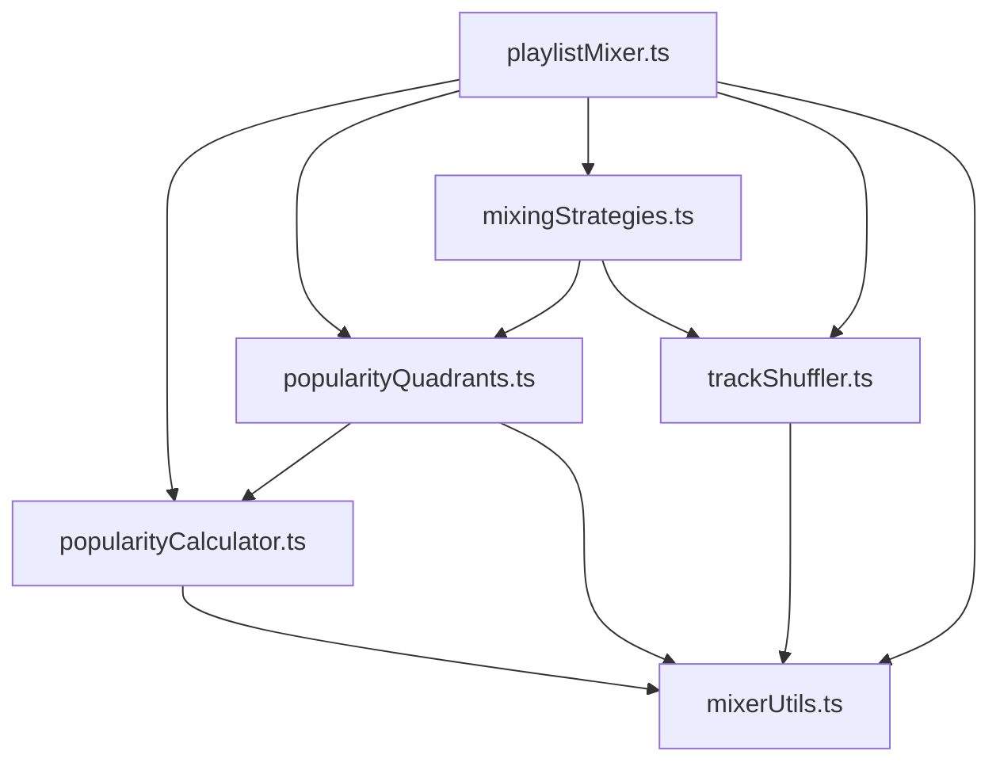

# Design Document

## Overview

This design document outlines the refactoring of the monolithic `src/utils/playlistMixer.ts` file into a modular, maintainable architecture. The current file contains over 1000 lines of code with multiple responsibilities including popularity calculations, track shuffling, quadrant creation, strategy-based selection, and the main mixing algorithm. The refactored architecture will separate these concerns into focused modules while maintaining backward compatibility and performance.

## Architecture

### Module Structure

The refactored architecture will consist of the following modules:

```
src/utils/mixer/
├── index.ts                    # Main export barrel
├── playlistMixer.ts           # Main orchestrator (reduced from 1000+ to ~200 lines)
├── popularityCalculator.ts    # Popularity and recency calculations
├── popularityQuadrants.ts     # Quadrant creation and management
├── mixingStrategies.ts        # Strategy pattern implementation
├── trackShuffler.ts          # Shuffling and randomization utilities
├── mixerUtils.ts             # General utility functions
└── types.ts                  # Internal types and interfaces
```

### Dependency Flow



## Components and Interfaces

### 1. Main Orchestrator (`playlistMixer.ts`)

**Responsibility:** Coordinate the mixing process by delegating to specialized modules.

```typescript
export interface MixerOrchestrator {
  mixPlaylists(
    playlistTracks: PlaylistTracks,
    ratioConfig: RatioConfig,
    options: MixOptions
  ): MixedTrack[];
}

export interface MixingContext {
  playlistTracks: PlaylistTracks;
  ratioConfig: RatioConfig;
  options: MixOptions;
  popularityPools: PopularityPools;
  totalWeight: number;
  estimatedTotalSongs: number;
}
```

**Key Functions:**
- `mixPlaylists()` - Main entry point (orchestrator)
- `createMixingContext()` - Initialize mixing context
- `validateInputs()` - Input validation
- `calculateTargetCounts()` - Calculate target song counts per playlist

### 2. Popularity Calculator (`popularityCalculator.ts`)

**Responsibility:** Handle all popularity-related calculations including recency boosts.

```typescript
export interface PopularityCalculator {
  calculateAdjustedPopularity(
    track: SpotifyTrack,
    recencyBoost: boolean
  ): PopularityData;
  
  calculateRecencyBonus(releaseDate: Date): number;
  
  sortTracksByPopularity(
    tracks: TrackWithPopularity[]
  ): TrackWithPopularity[];
}

export interface PopularityData {
  adjustedPopularity: number;
  basePopularity: number;
  recencyBonus: number;
  releaseYear: number | string;
}
```

**Key Functions:**
- `calculateAdjustedPopularity()` - Calculate popularity with optional recency boost
- `calculateRecencyBonus()` - Calculate recency bonus based on release date
- `sortTracksByPopularity()` - Sort tracks by adjusted popularity
- `getPopularityMetrics()` - Get popularity statistics for debugging

### 3. Popularity Quadrants (`popularityQuadrants.ts`)

**Responsibility:** Create and manage popularity-based track quadrants.

```typescript
export interface QuadrantManager {
  createPopularityQuadrants(
    tracks: SpotifyTrack[],
    recencyBoost: boolean
  ): PopularityQuadrants;
  
  createPopularityPools(
    playlistTracks: PlaylistTracks,
    options: QuadrantOptions
  ): PopularityPools;
}

export interface QuadrantOptions {
  recencyBoost: boolean;
  shuffleWithinGroups: boolean;
}

export interface PopularityQuadrants {
  topHits: TrackWithPopularity[];
  popular: TrackWithPopularity[];
  moderate: TrackWithPopularity[];
  deepCuts: TrackWithPopularity[];
}
```

**Key Functions:**
- `createPopularityQuadrants()` - Divide tracks into four popularity tiers
- `createPopularityPools()` - Create quadrants for all playlists
- `getQuadrantStats()` - Get statistics about quadrant distribution
- `validateQuadrants()` - Ensure quadrants are properly formed

### 4. Mixing Strategies (`mixingStrategies.ts`)

**Responsibility:** Implement different mixing strategies using the strategy pattern.

```typescript
export interface MixingStrategy {
  name: PopularityStrategy;
  getTracksForPosition(
    popularityPools: PopularityPools,
    playlistId: string,
    position: number,
    totalLength: number
  ): TrackWithPopularity[];
}

export interface StrategyManager {
  getStrategy(strategyName: PopularityStrategy): MixingStrategy;
  getAllStrategies(): MixingStrategy[];
}
```

**Strategy Implementations:**
- `MixedStrategy` - Random mix of all quadrants
- `FrontLoadedStrategy` - Popular songs first, fade to deep cuts
- `MidPeakStrategy` - Build to peak in middle, then fade
- `CrescendoStrategy` - Build from deep cuts to biggest hits

**Key Functions:**
- `createStrategyManager()` - Factory for strategy manager
- `getTracksForPosition()` - Get tracks based on strategy and position
- `addFallbackTracks()` - Add fallback tracks when strategy pools are exhausted

### 5. Track Shuffler (`trackShuffler.ts`)

**Responsibility:** Handle all shuffling and randomization operations.

```typescript
export interface TrackShuffler {
  shuffleArray<T>(array: T[]): T[];
  shuffleQuadrants(quadrants: PopularityQuadrants): PopularityQuadrants;
  shuffleWithinGroups(
    popularityPools: PopularityPools
  ): PopularityPools;
}
```

**Key Functions:**
- `shuffleArray()` - Fisher-Yates shuffle implementation
- `shuffleQuadrants()` - Shuffle tracks within each quadrant
- `shuffleWithinGroups()` - Shuffle tracks within popularity groups
- `getRandomTrack()` - Get random track from array with exclusions

### 6. Mixer Utils (`mixerUtils.ts`)

**Responsibility:** Provide utility functions used across multiple modules.

```typescript
export interface MixerUtils {
  safeObjectKeys(obj: any): string[];
  calculateTotalDuration(tracks: SpotifyTrack[]): number;
  validateTrack(track: SpotifyTrack): boolean;
  cleanPlaylistTracks(playlistTracks: PlaylistTracks): PlaylistTracks;
}
```

**Key Functions:**
- `safeObjectKeys()` - Defensive Object.keys implementation
- `calculateTotalDuration()` - Calculate total duration of tracks
- `validateTrack()` - Validate track object structure
- `cleanPlaylistTracks()` - Filter out invalid tracks
- `formatDuration()` - Format duration for display
- `logDebugInfo()` - Centralized debug logging

### 7. Internal Types (`types.ts`)

**Responsibility:** Define internal types and interfaces used within the mixer modules.

```typescript
export interface TrackWithPopularity extends SpotifyTrack {
  adjustedPopularity: number;
  basePopularity: number;
  recencyBonus: number;
  releaseYear: number | string;
}

export interface PlaylistTracks {
  [playlistId: string]: SpotifyTrack[];
}

export interface PopularityPools {
  [playlistId: string]: PopularityQuadrants;
}

export interface MixingState {
  mixedTracks: MixedTrack[];
  playlistCounts: { [key: string]: number };
  playlistDurations: { [key: string]: number };
  playlistExhausted: { [key: string]: boolean };
  attempts: number;
}
```

## Data Models

### Core Data Flow

1. **Input Validation**
   - Validate `playlistTracks`, `ratioConfig`, and `options`
   - Clean invalid tracks from playlists
   - Ensure required fields are present

2. **Popularity Processing**
   - Calculate adjusted popularity for all tracks
   - Apply recency boosts if enabled
   - Create popularity quadrants for each playlist

3. **Strategy Application**
   - Select appropriate mixing strategy
   - Get tracks based on position and strategy
   - Handle fallback when strategy pools are exhausted

4. **Track Selection Loop**
   - Determine next playlist based on ratio weights
   - Select tracks using strategy and position
   - Update tracking counters and state
   - Continue until target is reached or playlists exhausted

5. **Result Assembly**
   - Compile final mixed track list
   - Add metadata and source information
   - Return properly typed result

### State Management

The mixing process maintains state through a `MixingState` object that tracks:
- Current mixed tracks
- Songs added from each playlist
- Duration added from each playlist
- Which playlists are exhausted
- Number of attempts made

## Error Handling

### Input Validation Errors
- Invalid or empty `playlistTracks`
- Invalid or empty `ratioConfig`
- Missing required options

### Runtime Errors
- Playlist exhaustion handling
- Strategy fallback mechanisms
- Track validation failures
- Infinite loop protection

### Error Recovery
- Graceful degradation when playlists are exhausted
- Fallback to all quadrants when strategy pools are empty
- Defensive programming for array operations
- Clear error messages with context

## Testing Strategy

### Unit Testing Approach

1. **Module Isolation**
   - Each module tested independently
   - Mock dependencies for focused testing
   - Test both happy path and edge cases

2. **Popularity Calculator Tests**
   - Test recency bonus calculations
   - Test edge cases (missing dates, invalid popularity)
   - Test sorting algorithms

3. **Quadrant Manager Tests**
   - Test quadrant creation with various track counts
   - Test empty playlist handling
   - Test shuffling within quadrants

4. **Strategy Tests**
   - Test each strategy independently
   - Test position-based track selection
   - Test fallback mechanisms

5. **Integration Tests**
   - Test complete mixing workflows
   - Test with real-world data scenarios
   - Test performance with large playlists

### Test Data Strategy

- Create comprehensive mock data sets
- Include edge cases (empty playlists, single tracks)
- Test with various popularity distributions
- Include tracks with missing metadata

## Performance Considerations

### Memory Optimization
- Avoid unnecessary array copies
- Use efficient sorting algorithms
- Clean up temporary objects

### Computational Efficiency
- Cache popularity calculations where possible
- Optimize quadrant creation for large playlists
- Use efficient random selection algorithms

### Scalability
- Handle playlists with 1000+ tracks efficiently
- Maintain responsive performance during mixing
- Optimize for common use cases

## Migration Strategy

### Phase 1: Extract Utility Functions
- Move `safeObjectKeys`, `shuffleArray`, `calculateTotalDuration` to `mixerUtils.ts`
- Update imports in main file
- Ensure all tests pass

### Phase 2: Extract Popularity Calculator
- Move `getAdjustedPopularity` and related functions to `popularityCalculator.ts`
- Create proper interfaces and types
- Update main file to use new module

### Phase 3: Extract Quadrant Manager
- Move `createPopularityQuadrants` and `createPopularityPools` to `popularityQuadrants.ts`
- Integrate with popularity calculator
- Update main file

### Phase 4: Extract Mixing Strategies
- Move `getTracksForPosition` to `mixingStrategies.ts`
- Implement strategy pattern
- Create individual strategy classes

### Phase 5: Refactor Main Orchestrator
- Simplify main `mixPlaylists` function
- Focus on orchestration rather than implementation
- Ensure backward compatibility

### Phase 6: Testing and Validation
- Comprehensive testing of all modules
- Performance testing with large datasets
- Validation that output matches original implementation

## Backward Compatibility

### API Compatibility
- Maintain exact same function signature for `mixPlaylists`
- Ensure same input/output behavior
- Preserve all existing functionality

### Behavioral Compatibility
- Same mixing results for identical inputs
- Same error handling behavior
- Same performance characteristics

### Migration Safety
- Gradual migration with rollback capability
- Comprehensive test coverage before each phase
- Feature flags for new vs old implementation during transition